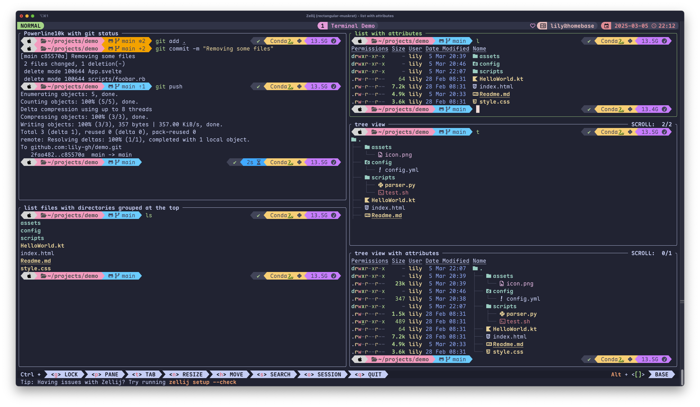

# 👩🏻‍💻 Hi, I'm Lily!
I like coding, and I create cool things and ~~Software~~ _Memeware_ on my (_very little_) freetime.

My most recent projects are:
  - [dev-bootstrap.sh](dev-bootstrap.sh) - Easily bootstrap a new computer with developer tooling in under 15min. ✨ 🚀
  - [Kitty Poker](https://kittypoker.org) - A Planning Poker app with a modern design and Catppuccin-inspired color palette. (still a WIP with some quirks here and there)
  - [Custom New Tab](https://github.com/lily-gh/custom-new-tab) - Replace the new tab page with a custom URL in Edge, Chrome or Firefox.
  - [UI Tools](https://ui-tools.lilyoliveira.com) - Set of UI tools including a color picker, image color picker and built-in Catppuccin Palette reference.
  - [Large Type Svelte](https://github.com/lily-gh/large-type-svelte) - Display and share text in a **LARGE FONT**, directly from your phone!
  - [Unphrazle](https://unphrazle.vercel.app/) - a tool that helps you find words for word-guessing games. (such as _Phrazle_)
  - [Oppressor Suppressor](https://github.com/lily-gh/oppressor-suppressor) - _need I say more?_


# Would you like to set up your terminal like this?



Assuming you're using zsh, here's what you'll need:

1. Install [Powerline10k with these instructions](https://github.com/romkatv/powerlevel10k#getting-started). (I use the [Maple Mono font](https://github.com/subframe7536/Maple-font), but any NerdFont should display the fancy glyphs nicely.
2. (optional) copy my Powerlevel10k configuration to make yours look the same:
```bash
curl https://raw.githubusercontent.com/lily-gh/devtools/main/p10k/.p10k.zsh >| ~/.p10k.zsh
```
⚠️ Note: you'll still need to manually select the `MesloLGS NF` / `Maple Mono NL NF` font family in your terminal's settings for the icons to show up properly.

3. Install eza for nicer file listing
```bash
brew install eza
```

Add these aliases in your `.zshrc`:
```bash
# checks if eza command is available before setting the aliases
if [ -x "$(command -v eza)" ]; then
    alias l="eza -1 --long --header --icons --group-directories-first"
    alias ls="eza -1 --group-directories-first"
    alias ll="eza --long --header --icons --group-directories-first --no-permissions --total-size"
    alias lp="eza --long --header --icons --group-directories-first --total-size"
    alias la="eza -a --long --header --icons --group-directories-first"
    alias lt="eza --tree --long --header --icons --git-ignore --group-directories-first"
    alias t="eza --tree --header --icons --git-ignore --group-directories-first"
fi
```

4. The tool I'm using for managing tabs and panes in the terminal is [Zellij](https://github.com/zellij-org/zellij).

<div align="center">
  <a href="https://github.com/CatsJuice/ssr-contributions-img">
    <picture>
      <source media="(prefers-color-scheme: dark)" srcset="https://ssr-contributions-svg.vercel.app/_/lily-gh?chart=3dbar&gap=0.6&scale=2&flatten=1&animation=wave&animation_duration=3&animation_delay=0.06&animation_amplitude=27&animation_frequency=0.1&animation_wave_center=0_3&format=svg&weeks=30&theme=pink&dark=true">
      <source media="(prefers-color-scheme: light)" srcset="https://ssr-contributions-svg.vercel.app/_/lily-gh?chart=3dbar&gap=0.6&scale=2&flatten=1&animation=wave&animation_duration=3&animation_delay=0.06&animation_amplitude=27&animation_frequency=0.1&animation_wave_center=0_3&format=svg&weeks=30&theme=pink">
      
    </picture>
  </a>
</div>

---

If you like the things I create, consider supporting me on [Ko-fi](https://ko-fi.com/lily_neinhorn) 💖

<div align="center">
    <a href="https://ko-fi.com/lily_neinhorn" target="_blank">
        
    </a>
</div>

---

<div align="center">
  
</div>

<p align="center">🩷🩷🩷🩷🩷</p>

<div align="center">
  
</div>
<br />

<div align="center">
  
</div>